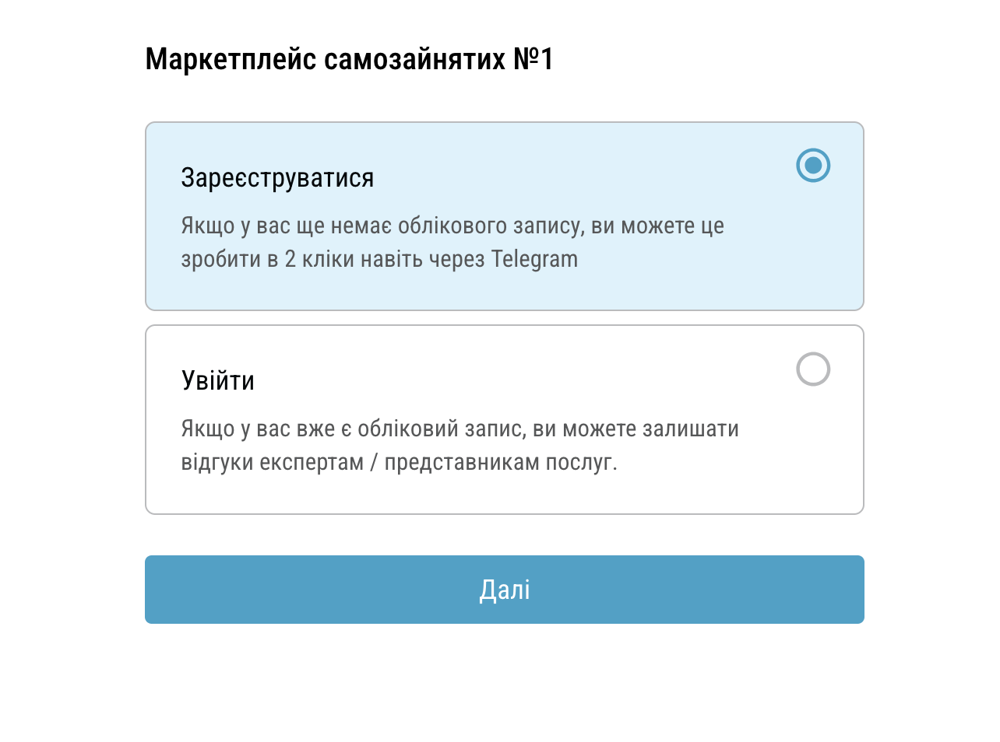
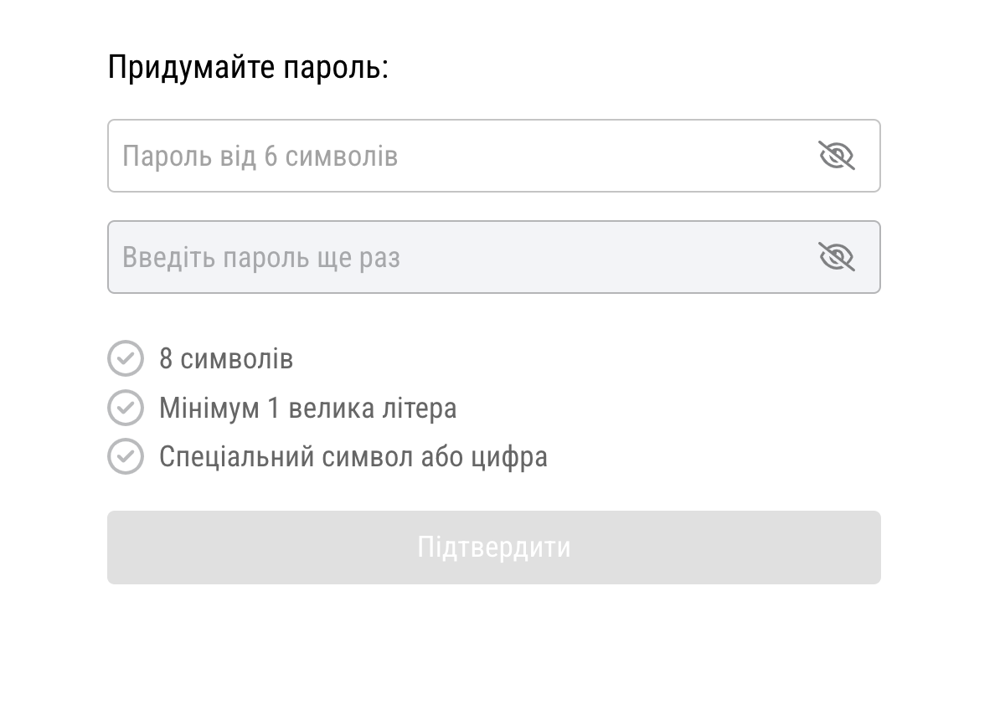

# 📋 Registration Checklist

## 🔹 Project Information:
- **Build:** 1.0  
- **Tester:** Halyna Kryva  
- **Environment:** macOS (x86) 14.6.1  
- **Browsers:** Chrome 132.0.6834.160, Safari, Firefox  

## 🔹 Test Cases:

| #  | Test Case Description                                         | Chrome | Firefox | Safari |
|----|--------------------------------------------------------------|--------|--------|--------|
| 1  | Ensure that the user can choose between "Register" and "Log in". | ✅ | ❌ | ✅ |
| 2  | Click "Register" and verify the transition to the registration form. | ✅ | ✅ | ✅ |
| 3  | Click "Log in" and verify the transition to the login form.  | ✅ | ✅ | ✅ |
| 4  | Select no option and verify that the "Next" button remains inactive. | ✅ | ❌ | ✅ |
| 5  | Ensure that "Telegram", "Google", and email registration options are displayed. | ✅ | ✅ | ✅ |
| 6  | Click the "Telegram" button and verify redirection to the respective service. | ✅ | ✅ | ✅ |
| 7  | Click the "Google" button and verify redirection to the respective service. | ✅ | ✅ | ✅ |
| 8  | Click "Next" without selecting a registration method and verify the error message. | ✅ | ❌ | ✅ |
| 9  | Ensure that the Email field is present and contains the placeholder `example@gmail.com`. | ✅ | ✅ | ✅ |
| 10 | Enter a valid email and verify the ability to proceed. | ✅ | ✅ | ✅ |
| 11 | Enter an invalid email and check that the "Next" button remains disabled. | ✅ | ❌ | ✅ |
| 12 | Leave the Email field empty, click "Next," and verify that the button remains inactive. | ✅ | ✅ | ✅ |
| 13 | Click the "Log in" link and verify redirection to the login page. | ✅ | ✅ | ✅ |
| 14 | Click "Next" after entering a valid email and verify the transition to the password screen. | ✅ | ✅ | ✅ |
| 15 | Ensure that the password and confirmation fields are displayed. | ✅ | ✅ | ✅ |
| 16 | Click "Confirm" without entering passwords and verify that the button remains inactive. | ✅ | ✅ | ✅ |
| 17 | Enter a password with fewer than 8 characters and check for a validation error. | ✅ | ✅ | ✅ |
| 18 | Enter a password without an uppercase letter and verify the validation message. | ✅ | ✅ | ✅ |
| 19 | Enter a password without a number or special character and verify the error message. | ✅ | ✅ | ✅ |
| 20 | Enter a valid password (8+ characters, 1 uppercase letter, 1 number) and verify that the "Confirm" button is enabled. | ✅ | ✅ | ✅ |
| 21 | Enter two different passwords and check for a mismatch error. | ✅ | ✅ | ✅ |
| 22 | Enter matching passwords and verify that the "Confirm" button is enabled. | ✅ | ✅ | ✅ |
| 23 | Click "Confirm" with a valid password and verify that the registration is completed successfully. | ✅ | ✅ | ✅ |
| 24 | Use an already registered email and verify that the system displays "Email is already in use". | ✅ | ✅ | ✅ |
| 25 | Refresh the page during password entry and verify that the user is returned to the input screen. | ✅ | ✅ | ✅ |
| 26 | Disconnect from the internet before clicking "Next" and verify that a network error message is displayed. | ✅ | ✅ | ✅ |
| 27 | Disconnect from the internet before clicking "Confirm" and verify that a network error message is displayed. | ✅ | ✅ | ✅ |
| 28 | Enter a password with 7 characters and verify a validation error for insufficient length. | ✅ | ✅ | ✅ |
| 29 | Enter a password with 8 characters and verify that it is accepted. | ✅ | ✅ | ✅ |
| 30 | Enter a password with 9 characters and verify that it is accepted. | ✅ | ✅ | ✅ |
| 31 | Enter a password with 50 characters (maximum allowed) and verify that it is accepted. | ✅ | ✅ | ✅ |
| 32 | Enter a password with 51 characters (exceeding max length) and verify that a validation error is displayed. | ✅ | ✅ | ✅ |
| 33 | Enter a password without uppercase letters (e.g., password1!) and verify a validation error. | ✅ | ✅ | ✅ |
| 34 | Enter a password with at least one uppercase letter (e.g., Password1!) and verify that it is accepted. | ✅ | ✅ | ✅ |
| 35 | Enter a password without numbers (e.g., Password!) and verify a validation error. | ✅ | ✅ | ✅ |
| 36 | Enter a password without special characters (e.g., Password1) and verify a validation error. | ✅ | ✅ | ✅ |
| 37 | Enter a password with both a number and a special character (e.g., Password1!) and verify that it is accepted. | ✅ | ✅ | ✅ |
| 38 | Enter a password with only numbers (12345678) and verify a validation error. | ✅ | ✅ | ✅ |
| 39 | Enter a password with spaces (Password 1!) and verify a validation error. | ✅ | ✅ | ✅ |
| 40 | Enter a password with non-ASCII characters (Pässwörd1!) and check if it is accepted or rejected according to system rules. | ✅ | ✅ | ✅ |
| 41 | Copy-paste a password into the field and verify that it maintains the expected formatting. | ✅ | ✅ | ✅ |

## 🔹 Notes:
- ✅ = Test passed  
- ❌ = Test failed  

## 📸 Screenshots of Registration Checklist

  
  
  
 

 
 

 
